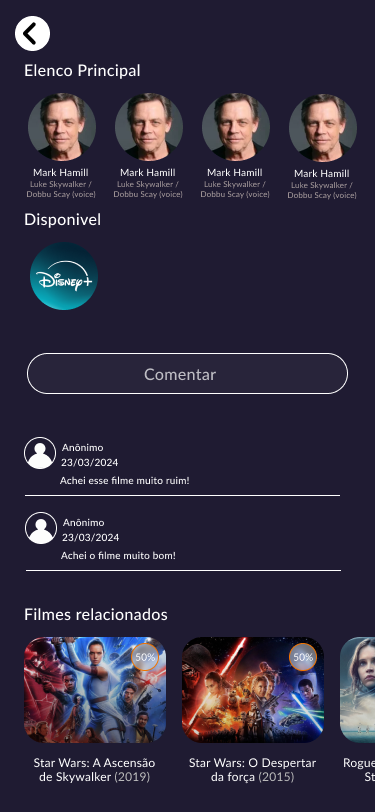

# Projeto-MobMovie

## Grupo-MobTech
- Hugo Vinícius Pessoa de Melo Santos
- Jonas Mariano de Oliveira Silva
- Caio Mario do Nascimento Silva
- Maria Eduarda Vieira da Silva

## API

- [The Movie Database](https://developer.themoviedb.org/reference/intro/getting-started)

## Figma

- [Prototipo](https://www.figma.com/file/1I0er8lO7XW10au6WJ9EI0/Movie-App-(Community)?type=design&node-id=0-1&mode=design&t=v4NdwdYJ018dm04Y-0)

## Funcionalidades

Funcionalidade 1: Tela Inicial (Home Screen)

- Mostrar um filme ou série recomendado.
- Ícone de usuário: ao pressionar, direciona para a tela de login, caso não esteja logado.
- Possui três abas, uma para filmes, uma para séries e uma para favoritos.
- Barra de pesquisa: ao ser pressionada, direciona para a tela de busca.
- Exibir um carrossel com os lançamentos de filmes ou séries.
- Apresentar um carrossel com filmes ou séries populares.
  
<table border="0">
    <tr>
        <td>
            
        </td>
        <td>
            
        </td>
        <td>
            
        </td>
    </tr>
</table>

Funcionalidade 2: Tela de Login

- Permitir que o usuário faça login com usuário e senha.
- Redirecionar para a tela inicial após o login bem-sucedido.
- Exibir uma opção para o usuário ir para a tela de cadastro.
- Possui a opção "Esqueceu a senha?", caso usuário tenha esquecido ou queira trocar sua senha.

<table border="0">
    <tr>
        <td>
            
        </td>
        <td>
            
        </td>
    </tr>
</table>

Funcionalidade 3: Tela de Cadastro

- Permitir que o usuário crie uma conta fornecendo o nome, email, usuário e senha.
- Armazenar os dados de login no Firebase.

<table border="0">
    <tr>
        <td>
            
        </td>
    </tr>
</table>

Funcionalidade 4: Tela de Busca

- Permitir ao usuário pesquisar filmes ou séries por título.

<table border="0">
    <tr>
        <td>
            
        </td>
    </tr>
</table>

Funcionalidade 5: Tela do Filme/Série

- Mostrar informações detalhadas sobre o filme/série, como sinopse, duração, gênero, disponibilidade e avaliação em porcentagem.
- Permitir ao usuário marcar como "Like" ou "Dislike".
- Permitir o usuário adicionar o filme na aba de favoritos. 
- Exibir comentários e avaliações dos usuários, com a opção de deixar um comentário.
- Apresentar filmes ou séries relacionados.

<table border="0">
    <tr>
        <td>
            
        </td>
        <td>
            
        </td>
    </tr>
</table>

Funcionalidade 6: Tela de Comentários

- Permitir ao usuário deixar um comentário.
- Armazenar os dados de comentários e avaliações no banco de dados.

<table border="0">
    <tr>
        <td>
            
        </td>
    </tr>
</table>

Funcionalidade 7: Tela dos Atores/Atrizes

- Exibir uma breve biografia e outras informações sobre o ator/atriz.
- Mostrar filmes ou séries em que os atores/atrizes atuaram.

<table border="0">
    <tr>
        <td>
            
        </td>
    </tr>
</table>

Funcionalidade 8: Avaliações em Porcentagem

- Mostrar uma avaliação em porcentagem para cada filme/série, representando a quantidade de pessoas que gostaram daquele título.
- Obter os dados de avaliações do Firebase e calcular a porcentagem de aprovação.

<table border="0">
    <tr>
        <td>
            
        </td>
    </tr>
</table>

Funcionalidade 9: Tela de Usuário

- Exibir a foto de perfil do usuário.
- Possui opções de ver a lista de favoritos, redefinição de email e senha.
- Permite que o usuário saia da conta sempre que quiser.

<table border="0">
    <tr>
        <td>
            
        </td>
        <td>
            
        </td>
        <td>
            
        </td>
    </tr>
</table>
